# Weather App
Musala Soft Android test

## Requirements
- Use Android Studio Chipmunk | 2021.2.1 or newer (unstable channels).
  Because I use [testFixtures](https://developer.android.com/studio/releases/gradle-plugin#test-fixtures) which is supported in this release.
- Add your google API key to `local.properties` file `MAPS_API_KEY=YOUR_API_VALUE`
  You can use this [debug](app/debug/app-debug.apk) or [release](app/release/app-release.apk) builds generated with my own restricted API key.

## Tech Stack
- Gradle 7.4 to get benefit from some new features:
    - [Version Catalog](https://docs.gradle.org/current/userguide/platforms.html#sub:version-catalog).
    - [Type-safe project accessors](https://docs.gradle.org/7.0/userguide/declaring_dependencies.html#sec:type-safe-project-accessors).
    - [Test Fixtures](https://docs.gradle.org/current/userguide/java_testing.html#sec:java_test_fixtures).
- Managing dependencies using [Version Catalog Update Plugin](https://github.com/littlerobots/version-catalog-update-plugin) and [Versions Plugin](https://github.com/ben-manes/gradle-versions-plugin).
- 100% Kotlin:
    - DSL.
    - Coroutines.
- Architecture:
    - Clean Arch + MVI.
    - Single Activity.
- Dagger Hilt for dependency injection.
- DataBinding.
- Jetpack Components.
- Retrofit for networking.
- Debugging Tools:
    - [Chucker](https://github.com/ChuckerTeam/chucker) to debug API requests on device.
    - [Timber](https://github.com/JakeWharton/timber) for logging.
    - Logging interceptor to log API requests.
- Unit Testing:
    - [Junit5](https://junit.org/junit5/docs/current/user-guide).
    - [Mockk](https://github.com/mockk/mockk).
    - [Kluent](https://github.com/MarkusAmshove/Kluent).
- Static analysis tools:
    - [Ktlint](https://github.com/pinterest/ktlint).
    - [Detekt](https://github.com/detekt/detekt).
- Other Libs and tools:
    - [Coil](https://github.com/coil-kt/coil) for image loading.
    - [Lottie](https://github.com/airbnb/lottie-android) for animation.
    - [Google Places SDK](https://developers.google.com/maps/documentation/places/android-sdk).
    - [Splash Screen API](https://developer.android.com/guide/topics/ui/splash-screen).

## Screenshots

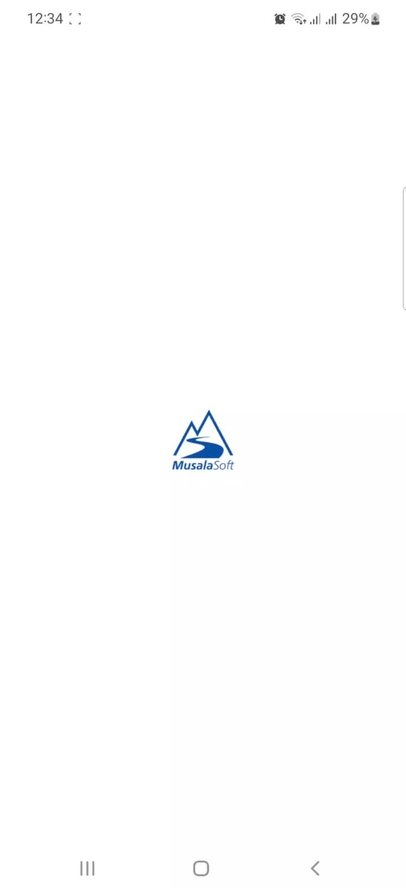
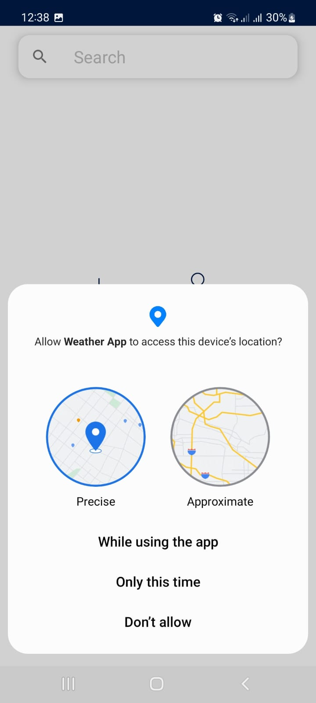
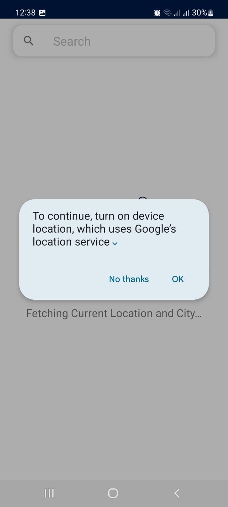

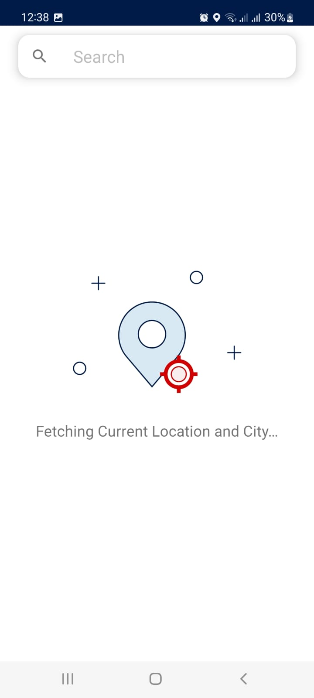
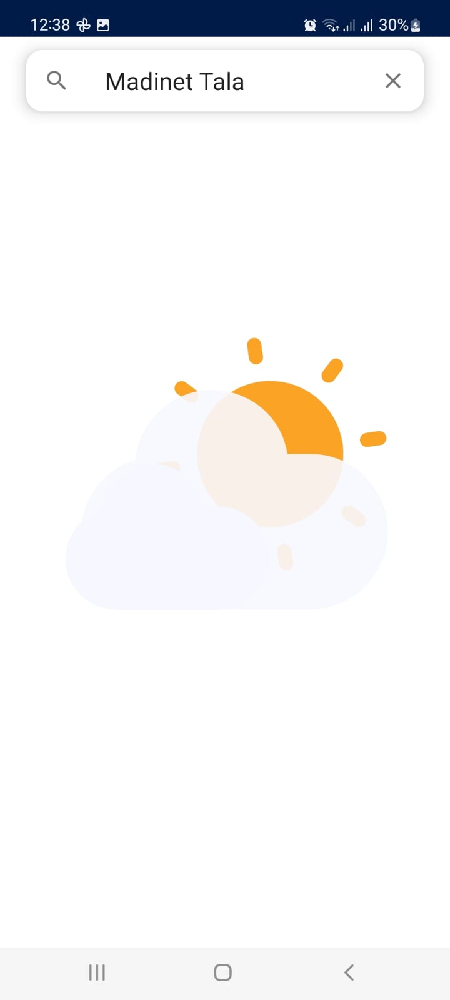
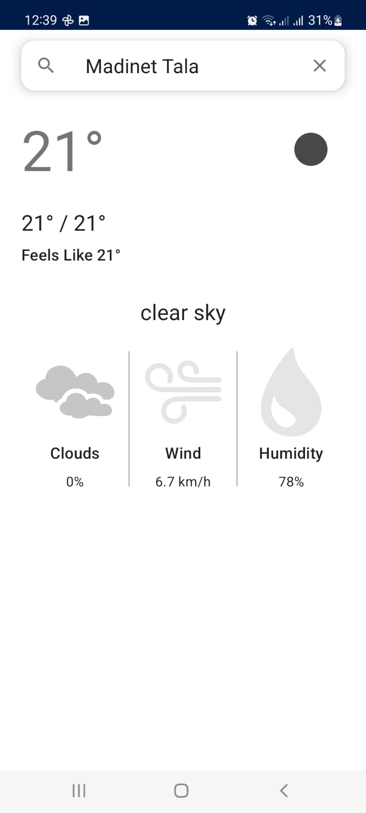

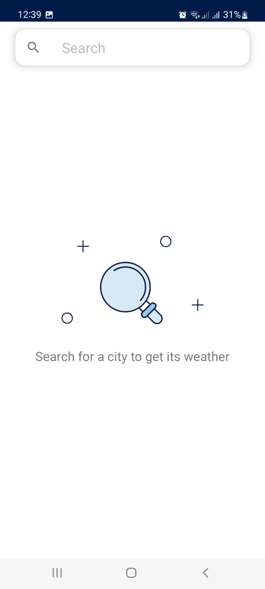
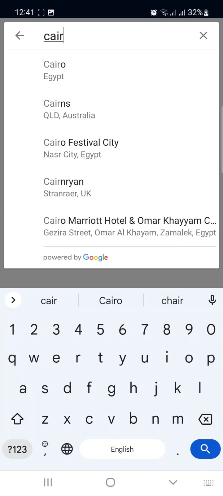
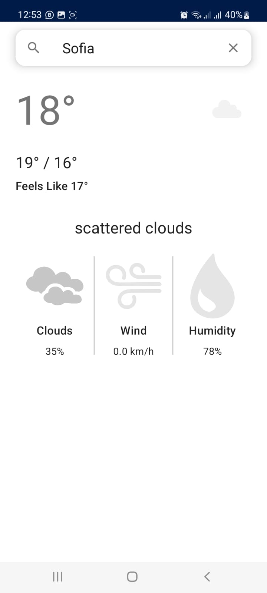

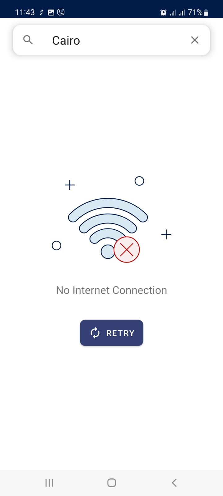
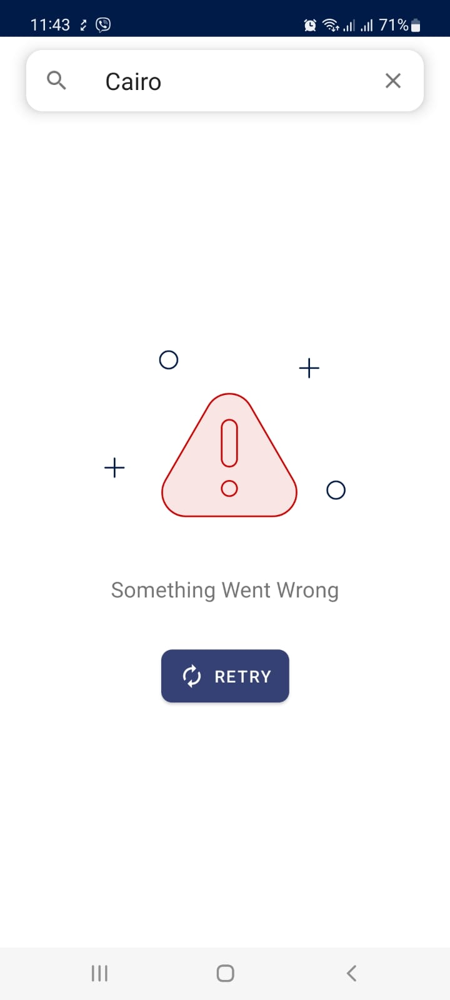

